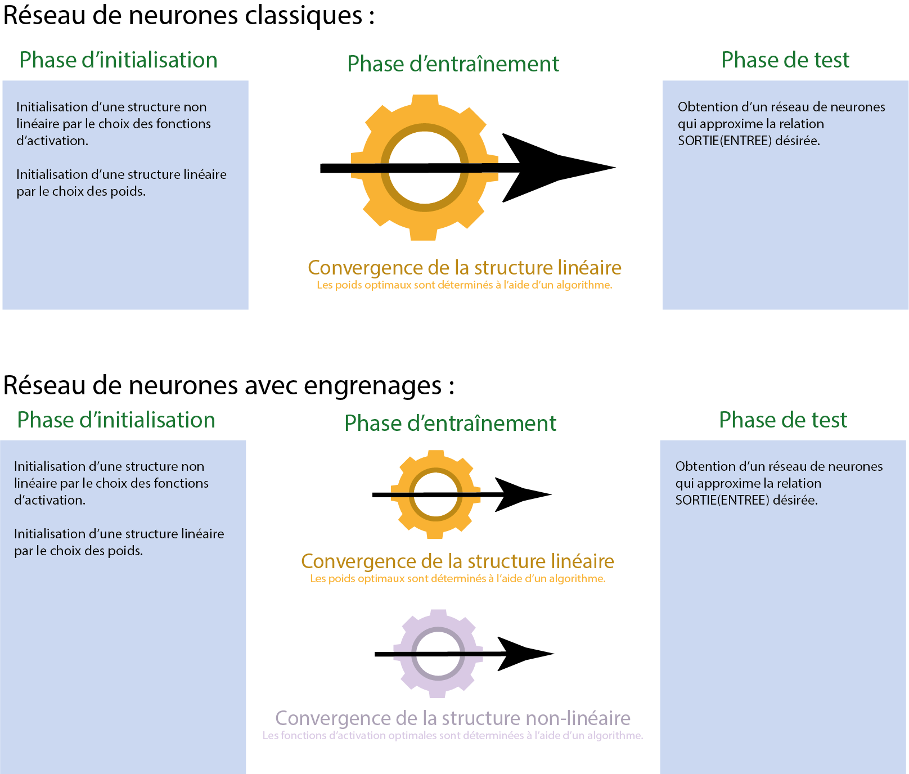
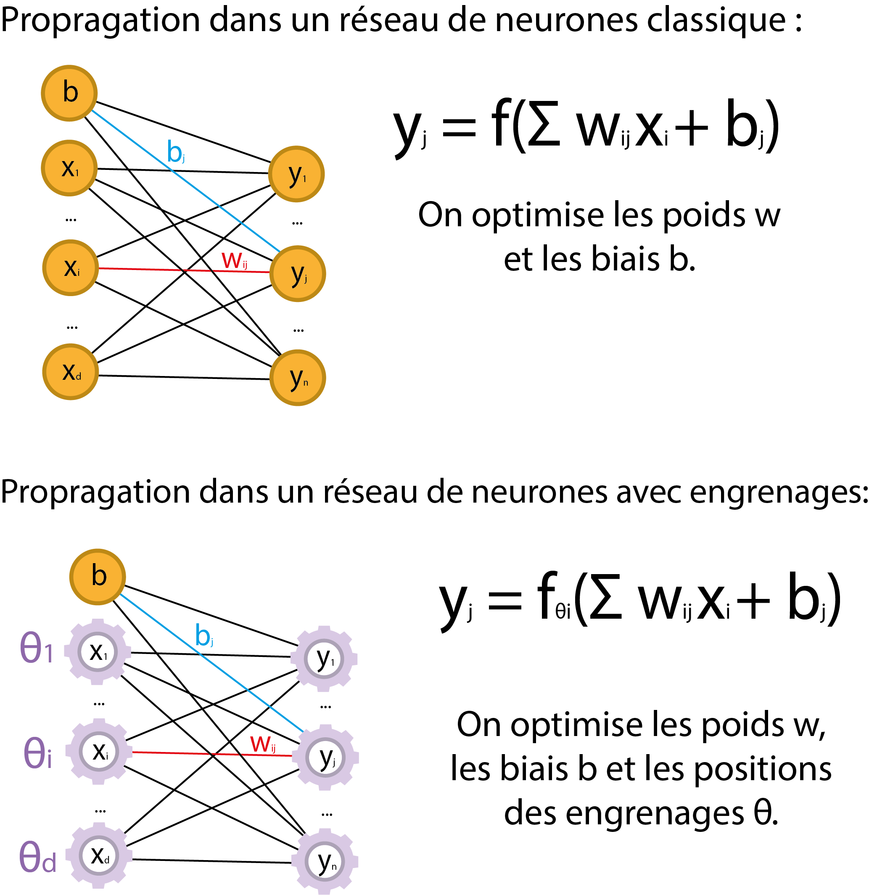
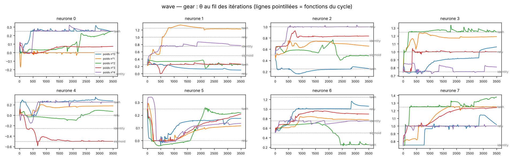
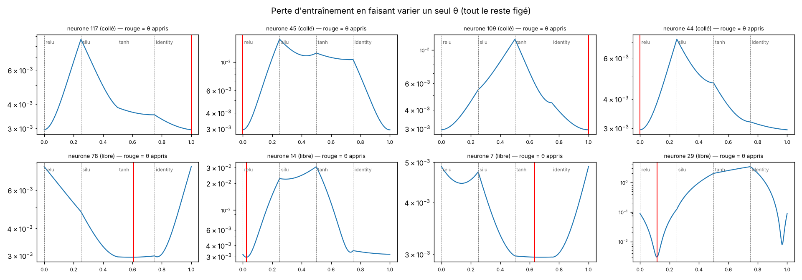
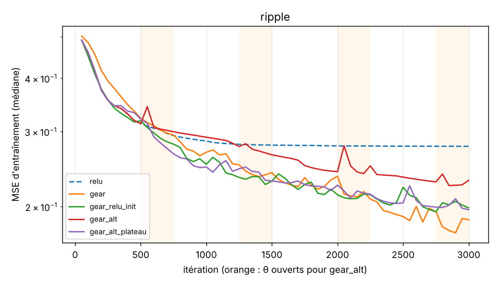
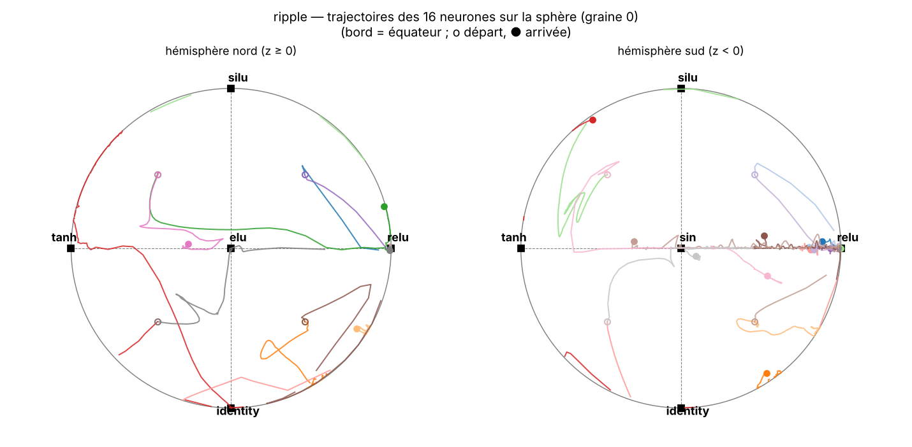

# Réseaux de neurones à engrenages

*Gear activations : chaque neurone apprend sa propre fonction d'activation en
tournant sur un cycle de fonctions, avec un seul paramètre.*

> **English summary.** Each neuron carries a single learnable angle θ that
> places it on a closed cycle of activation functions
> (relu → silu → tanh → identity → relu). Between two neighbouring functions,
> the activation is their linear interpolation. Weights, biases **and** θ are
> trained jointly by backpropagation (PyTorch). This is a constrained,
> one-parameter variant of learnable activation mixtures such as Adaptive
> Blending Units. Status: personal research project, concluded with a
> negative result (toy tasks, MLP on Fashion-MNIST, ResNet-20 on CIFAR-10).
> Main result: learned gears do not beat ReLU on standard architectures (ResNet-20:
> 90.26 % vs 90.55 %, 3 seeds), though they beat frozen random gears.
> A spherical variant (two degrees of freedom per neuron, functions at the
> vertices of an octahedron) is also implemented and tested.

---

## En bref

Projet de recherche personnel, **conclu en octobre 2026 sur un résultat
négatif** : sur des architectures standard, apprendre la fonction
d'activation de chaque neurone par un angle θ ne bat pas ReLU.

| ResNet-20, CIFAR-10 (60 époques, 3 graines) | Précision |
|---|---|
| ReLU | **90,55 ± 0,14 %** |
| engrenages | 90,26 ± 0,08 % |
| engrenages figés (contrôle) | 89,85 ± 0,30 % |

- Les engrenages sont sous ReLU dans les 3 graines, mais au-dessus des
  engrenages figés : apprendre θ corrige en partie un mauvais départ, sans
  rattraper la référence.
- Sur des tâches où l'activation compte (fonctions périodiques), apprendre θ
  aide nettement ; une version à deux paramètres (sphère) aide encore plus.
- Le réseau choisit des fonctions différentes selon la position dans le
  bloc résiduel, de façon reproductible : la première activation de chaque
  bloc garde ReLU (39 à 46 % des neurones), la seconde beaucoup moins (21 à
  24 %).
- La démarche est le point fort du dépôt : contrôles à θ figés, 3 à 10
  graines, règles de décision écrites avant les résultats, un défaut du code
  trouvé et corrigé par un test.

---

## L'idée



Dans un réseau classique, on choisit les fonctions d'activation à la main,
puis on n'optimise que les poids. Ici, chaque neurone possède un « engrenage » :
un angle θ ∈ [0, 1) qui le place sur un cycle de fonctions. Si θ tombe entre
les fonctions f_k et f_{k+1} :

```
f_θ(z) = (1 − t)·f_k(z) + t·f_{k+1}(z),   t = position de θ dans le segment k
∂f_θ/∂θ = (f_{k+1}(z) − f_k(z)) / longueur du segment
```



On optimise les poids w, les biais b **et** les positions θ des engrenages.

## Positionnement par rapport à l'existant

Apprendre un mélange de fonctions d'activation n'est pas nouveau :

- Adaptive Blending Units — Sütfeld et al., 2018 ([arXiv:1806.10064](https://arxiv.org/abs/1806.10064))
- *Learning Combinations of Activation Functions* — Manessi & Rozza, 2018 ([arXiv:1801.09403](https://arxiv.org/abs/1801.09403))
- *Activation Ensembles* — Harmon & Klabjan ([arXiv:1702.07790](https://arxiv.org/abs/1702.07790))
- SmartMixed, 2025 ([arXiv:2510.22450](https://arxiv.org/abs/2510.22450))
- Revue : Apicella et al., *Neural Networks* 138, 2021 ([arXiv:2005.00817](https://arxiv.org/abs/2005.00817))

Ce qui distingue les engrenages :

| | ABU / mélanges libres | Engrenages |
|---|---|---|
| Paramètres d'activation par neurone | n (un par fonction) | **1**, quel que soit n |
| Fonctions actives par neurone | toutes | **au plus 2** |
| Structure | combinaison libre | parcours d'un **cycle** (θ périodique) |
| Entraînement | en continu | possible dans une **fenêtre** d'époques seulement |

## Résultats

Résultats sur peu de graines, à prendre comme tels.
Détails : [docs/resultats_preliminaires.md](docs/resultats_preliminaires.md).

### Tâches jouets (5 initialisations des poids)

| Tâche | θ figés | engrenages | engrenages (fenêtre) |
|---|---|---|---|
| ET logique | 1,6e-5 | 6,7e-6 | 4,4e-6 |
| XOR | 4,0e-5 | 1,6e-5 | 1,2e-5 |
| y = x₁ + x₂ + bruit | 0,0103 | 0,0103 | 0,0103 |
| y = sin(2πx₁)·x₂ + bruit | 0,0120 | 0,0088 | 0,0112 |

*MSE finale médiane.* Avec les mêmes θ de départ, les θ finaux dépendent
fortement de l'initialisation des poids : il n'y a pas une configuration
optimale unique.



### MLP sur Fashion-MNIST (3 graines, 20 époques)

| Activation | Test (%) | Époques pour 88 % | s / époque (CPU) |
|---|---|---|---|
| SiLU | 89,29 ± 0,26 | 3,3 | 0,9 |
| ReLU | 89,01 ± 0,33 | 3,7 | 0,9 |
| engrenages figés (contrôle) | 88,94 ± 0,25 | 4,0 | 1,4 |
| **engrenages** | 88,91 ± 0,13 | 3,7 | 1,7 |
| PReLU | 88,81 ± 0,14 | 5,7 | 1,1 |
| ABU | 88,74 ± 0,30 | 8,0 | 1,5 |
| engrenages (fenêtre) | 88,70 ± 0,18 | 4,0 | 1,5 |

Aucune différence significative de précision : sur un MLP simple,
l'activation compte peu. Les engrenages convergent aussi vite que ReLU et deux
fois plus vite qu'ABU, avec 4 fois moins de paramètres d'activation. Constat
stable sur les 3 graines : le réseau abandonne presque totalement l'identité
(≈ 25 % des neurones y démarrent, 0 à 4 sur 512 y restent).

### ResNet-20 sur CIFAR-10 (3 graines)

Protocole de He et al. (2016), raccourci à 60 époques.

| Activation | Graine 0 | Graine 1 | Graine 2 | Moyenne ± écart-type |
|---|---|---|---|---|
| ReLU | 90,41 % | 90,54 % | 90,69 % | **90,55 ± 0,14** |
| engrenages | 90,18 % | 90,27 % | 90,33 % | 90,26 ± 0,08 |
| engrenages figés (contrôle) | 89,71 % | 89,65 % | 90,19 % | 89,85 ± 0,30 |

**Résultat : les engrenages ne battent pas ReLU.** Ils sont en dessous dans
les 3 graines (−0,23, −0,27, −0,36 point, soit −0,29 en moyenne). Ils font
en revanche mieux que les engrenages figés dans les 3 graines (+0,47, +0,62,
+0,14 ; +0,41 en moyenne), mais avec 3 graines cette avance est fragile. Les
θ servent donc à corriger en partie les mauvais choix de départ, sans
rattraper la référence. Un run dure 21 s par époque pour ReLU, 32 s pour les
engrenages (4 fonctions évaluées).

Les θ choisissent des fonctions différentes selon la position dans le bloc
résiduel, de façon identique dans les 3 graines : la première activation de
chaque bloc garde ReLU (46 %, 40 %, 39 % des neurones), la seconde beaucoup
moins (21 %, 21 %, 24 %), au profit de silu, tanh et identité.

### Le « collage » aux nœuds : sélection plutôt que piège

Les θ se fixent souvent exactement sur une fonction pure. `diagnostics/diag_nodes.py`
teste si c'est un optimum ou un blocage (tâche jouet, 3 graines) :

- **55 %** des θ collés sont sur un minimum de la perte en pointe (V) : la
  fonction pure est réellement la meilleure. L'interpolation linéaire crée un
  effet de **sélection**, comparable à la parcimonie du Lasso.
- Écartés de ±0,03, **69 %** reviennent sur leur nœud ; et pendant
  l'entraînement, beaucoup se décollent d'eux-mêmes. Ce n'est pas un blocage
  permanent.
- Si `lr_theta` est trop faible (1e-4), les θ ne bougent presque pas ; trop
  fort (0,1), l'entraînement se dégrade. Entre les deux (1e-3 à 1e-2), les
  engrenages entraînés font mieux que les engrenages figés (MSE 0,0034 contre
  0,0041 ± 0,0005).



*Perte en faisant varier un seul θ (rouge : valeur apprise). En haut, des
neurones collés sur relu, au fond d'une pointe ; en bas, des neurones libres,
dans un creux lisse.*

### Partir de ReLU, ouvrir les engrenages par intervalles

Idée : laisser le réseau converger comme un réseau ReLU, ouvrir les
engrenages, les refiger, recommencer jusqu'à ce que les θ ne bougent plus
(`gear_alt`, calendrier fixe ; `gear_alt_plateau`, déclenché quand la perte
d'entraînement se stabilise).

- **Tâches jouets** (10 graines) : l'alternance ne fait pas mieux que
  l'entraînement continu depuis ReLU, et chaque ouverture fait remonter la
  perte un moment.
- **MLP Fashion-MNIST** (3 graines) : les deux alternances sont en tête
  (89,25 et 89,26 % contre 89,01 % pour ReLU), mais l'écart reste sous le
  seuil de significativité. Test ResNet à faire.



### Engrenages sphériques : 2 paramètres par neurone



Sur le cercle, chaque fonction n'a que deux voisines, dans un ordre arbitraire.
Sur la sphère, chaque neurone porte une direction u ∈ S², et les fonctions
sont aux sommets d'un octaèdre. L'équateur reprend le cycle du cercle
(relu → silu → tanh → identité) ; les pôles ajoutent elu et sin. La direction
traverse une face triangulaire, et les poids sont les coordonnées
barycentriques du point de traversée : au plus 3 fonctions actives, 1 sur un
sommet, 2 sur une arête (`gears/gear3d.py`). Une variante à noyau
(w ∝ exp(κ·⟨u, p_i⟩)) est lisse, mais garde toutes les fonctions actives.

**Tâches jouets** (réseau 2 → 16 → 1, 10 graines, MSE de validation médiane ×10⁻³) :

| Variante | wave | ripple sin(3π‖x‖) |
|---|---|---|
| ReLU | 14,4 | 293 |
| cercle, 4 fonctions | 8,8 | 205 |
| cercle, 6 fonctions | 5,7 | 211 |
| **sphère** | 5,4 | **151** |
| **sphère à noyau** | 4,6 | **113** |
| sphère figée (contrôle) | 4,6 | 207 |

- Sur `ripple`, entraîner la direction aide nettement. La sphère fait mieux
  que la même sphère figée sur 9 graines sur 10 (erreur environ 1,5 fois plus
  faible), et mieux que le cercle à 6 fonctions sur 9 sur 10.
- Sur `wave`, la sphère figée fait aussi bien : le gain vient du mélange de
  3 fonctions, pas de l'apprentissage de la direction. Sur `bump`, aucune
  différence.
- Les neurones se collent surtout sur des **arêtes** (mélange de 2
  fonctions). Pour `ripple`, beaucoup finissent sur l'arête relu–sin
  (figure ci-dessus).

**MLP sur Fashion-MNIST** (3 graines, 20 époques, mêmes 6 fonctions partout) :

| Activation | Test (%) |
|---|---|
| ReLU | 89,01 ± 0,33 |
| cercle, 4 fonctions | 88,91 ± 0,13 |
| cercle, 6 fonctions | 88,90 ± 0,03 |
| sphère | 88,90 ± 0,14 |
| ABU, 6 fonctions | 88,78 ± 0,29 |
| sphère à noyau | 88,70 ± 0,11 |
| sphère figée (contrôle) | 88,55 ± 0,17 |

Aucune différence significative, comme pour le cercle. Deux constats
cohérents avec les jouets : la sphère entraînée bat la sphère figée sur les
3 graines (+0,06 à +0,60 point), et le réseau abandonne de nouveau l'identité
(17 % des neurones à l'initialisation, 1 à 2 % à la fin) au profit de sin.

## Lancer le code

```bash
pip install -r requirements.txt
python tests/test_gear.py                  # 15 tests
python tests/test_gear3d.py                # 11 tests (sphère)
```

Les scripts se lancent depuis la racine du dépôt (ou avec le bouton ▶ de VS Code,
avec leurs réglages par défaut). Les résultats vont toujours dans `results/` à la
racine, quel que soit le dossier de lancement.

| Script | Contenu | Matériel |
|---|---|---|
| `experiments/exp1_toy.py` | tâches jouets, trajectoires de θ pour 5 initialisations | CPU, ~3 min |
| `experiments/exp2_mlp.py` | MLP sur MNIST / Fashion-MNIST, 7 activations, plusieurs graines | CPU possible |
| `experiments/exp3_resnet.py` | ResNet-20 sur CIFAR-10 | GPU |
| `experiments/run_resnet.py` | enchaîne les runs ResNet (réglages en tête de fichier) | GPU |
| `experiments/exp4_alternance.py` | départ ReLU et ouverture des engrenages par intervalles (jouets) | CPU, ~10 min |
| `experiments/exp3d_1_toy.py` | sphère : tâches jouets, 6 variantes, 10 graines | CPU, ~40 min |
| `experiments/exp3d_2_mlp.py` | sphère : MLP Fashion-MNIST, 7 variantes | CPU, ~30 min |
| `experiments/exp3d_3_resnet.py` | sphère : runs ResNet-20 (réglages en tête de fichier) | GPU |
| `diagnostics/diag_nodes.py` | diagnostic du collage aux nœuds (`--quick` : 30 s) | CPU, ~3 min |

Pour reproduire le tableau MLP :
`python experiments/exp2_mlp.py --dataset fashion --seeds 3 --epochs 20 --gear-window 3 10`.

Pour le ResNet, un GPU est nécessaire (par exemple Google Colab : activez le
GPU, envoyez le dossier, puis `!python experiments/run_resnet.py`). Un checkpoint est écrit
à chaque époque, et relancer le script reprend un run interrompu.

### Variantes comparées

| Nom | Description | Rôle |
|---|---|---|
| `relu`, `silu` | activation fixe | référence |
| `prelu` | 1 paramètre par neurone | même nombre de paramètres que les engrenages |
| `abu` | Adaptive Blending Units | méthode existante la plus proche |
| `gear` | engrenages entraînés | la méthode |
| `gear_window` | θ entraînés dans une fenêtre d'époques | « structure linéaire, puis non linéaire » |
| `gear_relu_init` | tous les θ placés sur ReLU au départ, puis entraînés | le réseau démarre **identique** à la référence ReLU |
| `gear_alt` | départ ReLU, θ figés puis ouverts par intervalles fixes | laisser converger, ouvrir, refiger, recommencer |
| `gear_alt_plateau` | départ ReLU, ouverture quand la perte d'entraînement se stabilise, fermeture quand les θ ne bougent plus | même idée, déclenchée automatiquement |
| `gear_frozen` | θ aléatoires, jamais entraînés | **contrôle** : le gain vient-il de l'apprentissage des θ ? |
| `gear6`, `abu6` | cercle et ABU sur les 6 fonctions de la sphère | contrôles à nombre de fonctions égal |
| `sphere` | engrenages sphériques (barycentriques) | 2 degrés de liberté par neurone |
| `sphere_kernel` | sphère, poids à noyau | variante lisse, sans collage |
| `sphere_frozen` | directions aléatoires figées | **contrôle** de la sphère |
| `sphere_relu_init` | toutes les directions sur le sommet ReLU au départ | idem pour la sphère |

## Structure du dépôt

```
gears/          bibliothèque : gear.py (cercle, ABU), gear3d.py (sphère), utils.py (graines, journaux, graphiques)
experiments/    expériences : exp1_toy, exp2_mlp, exp3_resnet, run_resnet, exp4_alternance (cercle) ;
                exp3d_1_toy, exp3d_2_mlp, exp3d_3_resnet (sphère)
diagnostics/    analyses du comportement des θ : diag_nodes (collage aux nœuds)
tests/          tests unitaires
docs/           résultats détaillés, critères de décision fixés d'avance
assets/         figures du README
```

## Limites

- L'implémentation évalue toutes les fonctions du cycle puis pondère : elle
  n'exploite pas l'économie de calcul (2 fonctions par neurone), donc elle
  est plus lente que ReLU (32 s contre 21 s par époque sur ResNet-20).
- L'ordre des fonctions sur le cycle est arbitraire, et le placement des
  fonctions sur la sphère est fait à la main.
- Peu de graines (3 au plus pour les gros réseaux), protocole raccourci à 60
  époques sur CIFAR-10, une seule architecture de convolution.
- Les variantes qui partent de ReLU (`gear_relu_init`) et l'alternance
  figé / entraîné ont été testées sur les jouets et le MLP, **pas sur le
  ResNet** ; la sphère non plus. Ces tests restent à faire
  ([docs/ROADMAP.md](docs/ROADMAP.md)).

## Historique

L'idée date d'août 2025. La première implémentation, en NumPy, avait un signe
de mise à jour inversé pour les engrenages et pas de vraie rétropropagation :
ses premiers résultats ne permettaient pas de conclure. Le projet a été
réécrit en PyTorch en octobre 2026, avec des contrôles et des critères de
décision fixés à l'avance.
